# Marky-Ai: AI driven Affiliate Marketing Automation project!

An ai affiliate marketing solution that automate the whole process end to end from getting the niches, choosing the best affiliate programs and provide insights on what are the best campaigns with ROI and useful comprehensive financials reports and ai driven decisions 

**Enjoy!**

<!--
suggest an image for a system that does this?
an ai affiliate marketing solution that automate the whole process end to end from getting the niches, choosing the best affiliate programs, creates campaigns and generate content and provide insights on what are the best campaigns with ROI to simplify the whole process and useful comprehensive financials reports and ai driven decisions 
Perhaps make it look as something that streamline the whole process with ai in the center of it?

a cyborg that represents the ai that will help to simplify and accelerate affiliate marketing, by streamlining the process from getting the best niches, the best affiliate programs, campaign creation and content, and a comprehensive report that helps to drive the decisions on what campaigns are getting the most ROI

suggest an image represents the ai that will help to simplify and accelerate affiliate marketing process, by streamlining the process from getting the best niches, the best affiliate programs, campaign creation and content, and a comprehensive report that helps to drive the decisions on what campaigns are getting the most ROI

-->

**Step 1**

This is the process flow to get new niches.
Essentially this can be triggered manual or by a cronjob that runs every (hour).

And it goes like this:

1.  The process call the Niche Lambda Function
2. It adds itself to a Queue (SQS)
3. If nothing in the queue, the Lambda Function gets the prompt from a config file
4. Pings (Geminini) AI with the prompt
5. Save Results in a File  

```mermaid
%%{init: {'securityLevel': 'loose'}}%%
flowchart LR
    %% External ID: get-niches-process-flow-id-1
    Start(("Start: Step 1: Get Niche"))  -- Hourly CronJob Or Manual Calls to Lambda --> B[["Scheduler"]]
    B -- Add Query to Queue --> V>"Query Added to Queue"]
    V --> C{"Is there anything in the Queue? (SNS)"}
    C -- No, clean up and finalise --> U
    C -- Yes, let's check if the previous process is finished --> W{Has the Previous Process Finished?}
    W -- Yes, Process the Queue --> D[["Process Niche Queue"]]
    W -- Re check the queue until the process is finished --> C
    D -- Queue is being processed --> X[["Get Niche Lambda"]]
    X -- Ping Gen AI to get list of niches --> E("Gemini AI")
    E -- Get Results --> F{"Is this your First Time?"}
    %% this case is unlikely to happen
    F -- Yes, Call Settler to process New Result --> Q[["Lambda Settler"]]
    Q -- Process All tasks --> Z[["Run Lambda Processor"]]
    %%TASKS: Save File to S3, Create Repo, Commit File to Repo, Publish Notification
    Z -- Save Brand New File to Bucket --> H[("Niche S3 Bucket")]
    Z -- Create Niche Repo --> I[["Github"]]
    Z -- Commit file to Repo --> I
    Z -- Add Niche/s to Database --> K[("Niche DynamoDB")]
    Z -- Publish Event to Niche SNS --> R>"Call SNS for Notifications"]
    T -- Notify Markeeter of any new files or niches to review --> L[/"Marketeer"\]
    %% This is the path that will happen every day
    F -- No, Call Parser to Process Results --> N[["Lambda Parser"]]
    %%H -- Get File from S3 --> N
    N -- Execute Parsing --> AA[["Parse Reviewer"]]
    AA -- Parser Review Results --> O{"Is There a New Niche?"}
    O -- Yes, Notify please --> R
    O -- Yes, Call Lambda Processor to process tasks --> Z
    %%TASKS(Parsing Results): Check out new branch, Save the new file, Commit file
    Z -- Check out and Create Branch --> I
    Z -- Save and Overwrite previous File on S3 Bucket --> H
    Z -- Commit File to Branch --> I
    O -- No, clean up --> U[["Run Clean up Process"]]
    R --> T[["Niche SNS Topic Send Notifications"]]
    L -- Review Results --> S{"Accept Results?"}
    S -- Yes, Process All tasks --> Z
    %% TASKS (After Review): Merge Branch, Save File to Bucket updated after review, Update DB, Clean up
    Z -- Merge Branch --> I
    Z -- Yes, Save File to Bucket with New Niche --> H
    Z -- Update DB with new Niche --> K
    Z -- Finalise and Clean up --> U
    S -- No, let's get out of here --> U
    I & H & K-- Github Actions call Parser, Compare File with Results --> N
    N -- Check if the queue is empty --> C
    U -- Set the Process Finished Flag to True --> Y>"Process Finished"]
    Y -- Call Scheduler --> B
    Y -- Trigger Step 2 --> End((("End Step 1")))
    %%subgraph Step 2
    %%End-->StartA(("Start Step 2: Get Affiliate Program"))
    %%end
    classDef processStyle stroke-width:2px,stroke-dasharray: 2,stroke:#000000,fill:#FFD600;
    class T,U,N,Q,B,D,X,Z,AA processStyle;
    classDef startEndStyle stroke:none,fill:#4CAF50,color:#FFFFFF,stroke-width:4px,stroke-dasharray: 0;
    class Start,End,StartA startEndStyle;
    classDef labelStyle fill:#FFE0B2,stroke:#000000
    class R,V,Y labelStyle
    classDef decisionStyle color:#FFFFFF,fill:#D50000,stroke-width:4px,stroke-dasharray: 5,stroke:#000000
    class F,C,M,O,W,S decisionStyle
    classDef dbStyle stroke:#000000,fill:#BBDEFB
    class K,H dbStyle
    style E fill:#2962FF,color:#FFFFFF
    style I stroke-width:1px,stroke-dasharray: 0,fill:#000000,color:#FFFFFF
    style L stroke-width:4px,stroke-dasharray: 5,stroke:#000000,fill:#FF6D00
```

